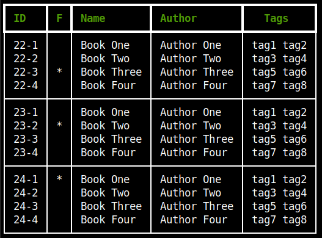

# quotes

Manage your book quotes.

  
  

## Features

* Manage your book quotes in a simple way
* Search by book name, author, reading year, tag or favorites
* Search a query through all the quotes in the database
* Show a table with all the authors
* Show a table with all the tags

## Dependencies

* Rich

## Installation

```bash
wget https://raw.githubusercontent.com/lfm-dev/quotes/main/install.sh && bash install.sh
```

## Usage

Example files can be found in the examples folder.  
Each year should have a different markdown file, with the YYYY.md format. The .md files have to be written in the following way:

```markdown
#Book Name/Book Author
[tag1,tag2,tag3,...,tagn]

* Quote 1.
Here you can write your quote.
You can use more than one line per quote, a new quote only begins with "*"
* Quote 2. You can write as many quotes as you want.
```

Book tags are optional.
To mark a book as favorite, write an * at the end of the title line.

```markdown
#Favorite Book Name/Book Author*
```

## Options

| Options      | Description        | Query  |
|--------------|--------------------|--------|
| -h, --help   | show help          | - |
| -b, -books   | search books       | book id, book name, author name, reading year or tag (empty to show all books, favs to show favorites)|
| -q , -quotes | search quotes      | any word |
| -a, -authors | show authors table | author name |
| -t, -tags    | show tags table    | tag |


